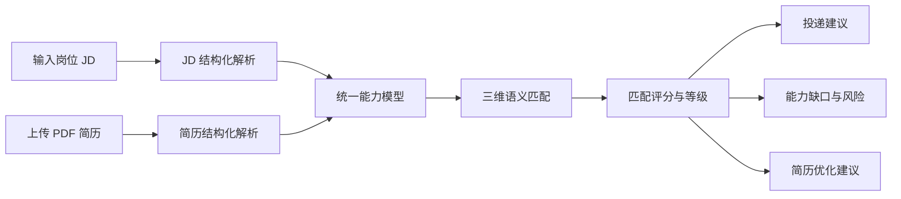
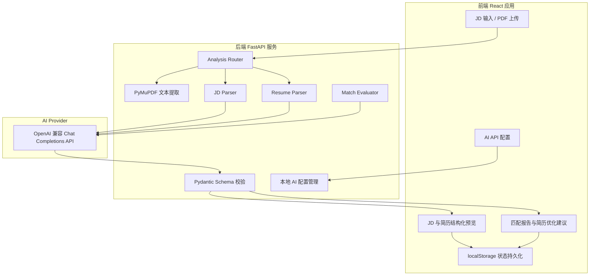

# Career Match Copilot

> 你的 AI 求职助手

Career Match Copilot 是一个面向学生求职场景的 AI 岗位匹配与简历优化工具。用户可以输入岗位 JD、上传 PDF 简历，系统会分别完成结构化解析，并基于技能、任务和领域三个维度生成匹配评分、投递建议、能力缺口与简历优化方案。

## 问题诊断

### 1. 求职信息过载

学生需要在多个招聘平台中浏览大量岗位信息，但缺乏统一的能力匹配标准，岗位筛选耗时且难以形成稳定判断。

### 2. 岗位理解成本高

JD 通常由职责、任职要求、加分项和软性表达组成。非结构化文本使用户难以快速识别岗位的核心技能、真实任务、领域方向与级别要求。

### 3. 自我能力认知偏差

用户对简历中已经体现的技能、项目、任务和行业经验缺乏结构化认知，因此难以判断自身能力与目标岗位之间的匹配程度。

### 4. 决策链路缺失

用户在“是否投递”这一关键节点缺少量化依据，容易依赖主观感觉或零散经验，导致投递效率低、结果不稳定。

## 方案设计

系统对岗位 JD 与用户简历进行结构化解析，并基于双向语义匹配与评分机制，输出岗位匹配等级、投递决策建议、能力缺口、风险因素与简历优化方案，从而提升求职决策效率与简历初筛命中率。



## 核心功能

### JD 结构化分析

- 提取岗位名称、行业、业务领域和岗位类型
- 识别硬技能、任务能力与软技能
- 归纳岗位职责、任职条件与加分项
- 判断岗位级别：`junior`、`mid`、`senior` 或 `unknown`

### 简历结构化分析

- 从 PDF 中提取文本并过滤姓名、电话、邮箱等个人信息
- 提取学历、专业、技能和任务行为
- 拆解项目经历与实习经历
- 建立可用于匹配计算的候选人能力模型

### 三维匹配评分

| 维度 | 权重 | 对比内容 |
| --- | ---: | --- |
| 技能匹配 | 40% | JD 技能要求与简历技能、项目及实习技能 |
| 任务匹配 | 40% | JD 职责与候选人实际执行过的任务 |
| 领域匹配 | 20% | 岗位领域与候选人的项目、实习及经验领域 |

最终得分由后端按照固定公式计算，避免模型直接决定总分：

```text
final_score = skill_match × 0.4
            + task_match × 0.4
            + domain_match × 0.2
```

匹配等级与投递建议：

| 分数 | 匹配等级 | 建议 |
| --- | --- | --- |
| 80-100 | High | apply |
| 60-79 | Medium | maybe |
| 0-59 | Low | not_recommended |

### 简历优化建议

匹配完成后，系统会针对目标岗位输出结构化建议：

- 需要优化的简历模块
- 当前表达与 JD 对齐不足的位置
- 具体修改动作
- 基于简历已有事实的参考改写

Prompt 明确禁止虚构项目、职责、技能和量化数据。真实缺失的能力会进入能力缺口，而不会被包装成候选人已经具备的经历。

### API 配置与结果持久化

- 支持 Google AI Studio 的 OpenAI 兼容接口
- 支持自定义 OpenAI Chat Completions 兼容 Base URL
- API Key 保存在本机后端 `.env` 文件中，不返回前端
- 配置一次后可重复使用
- 最近一次 JD、简历和匹配结果保存在浏览器 `localStorage`
- 上传新的 JD 或简历后，系统会更新对应结构化结果并重新计算匹配

## 产品架构



## AI 分析链路

1. **JD Parser**：将非结构化 JD 转换为稳定 JSON，仅提取原文中有证据的信息。
2. **Resume Parser**：后端使用 PyMuPDF 提取 PDF 文本，再由模型生成候选人能力结构。
3. **Match Evaluator**：对技能、任务和领域进行语义匹配，生成三个维度的分数及解释。
4. **Deterministic Scoring**：后端根据固定权重重新计算总分、匹配等级与投递建议。
5. **Schema Validation**：所有 AI 输出经过 Pydantic 校验；字段缺失或 JSON 不合法时自动重试一次。

## 技术栈

### 前端

- React 18
- TypeScript
- Vite
- React Router
- Tailwind CSS
- shadcn/ui / Radix UI
- TanStack Query
- Sonner
- Lucide React

### 后端

- Python 3
- FastAPI
- Uvicorn
- Pydantic
- OpenAI Python SDK
- PyMuPDF
- python-dotenv
- SQLAlchemy / aiosqlite（模板基础设施）

### AI 与数据

- Google AI Studio OpenAI-compatible API
- 支持自定义 OpenAI Chat Completions 兼容接口
- JSON mode + Pydantic Schema 结构化输出
- 浏览器 `localStorage` 保存最近一次分析状态
- 后端 `.env` 保存本地 AI 配置

## 目录结构

```text
.
├── README.md
├── app
│   ├── backend
│   │   ├── core
│   │   ├── routers
│   │   │   └── analysis.py
│   │   ├── schemas
│   │   │   └── analysis.py
│   │   ├── services
│   │   │   ├── ai_config.py
│   │   │   ├── aihub.py
│   │   │   └── analysis.py
│   │   ├── .env.example
│   │   ├── main.py
│   │   └── requirements.txt
│   └── frontend
│       ├── src
│       │   ├── components
│       │   ├── lib
│       │   └── pages
│       ├── package.json
│       └── vite.config.ts
└── .gitignore
```

## 本地运行

### 环境要求

- Python 3.10+
- Node.js 18+
- pnpm
- Google AI Studio API Key，或其他 OpenAI 兼容服务的 API Key

### 1. 克隆项目

```bash
git clone https://github.com/caitinn/Career-Match-Copilot.git
cd Career-Match-Copilot
```

### 2. 启动后端

```bash
cd app/backend
python3 -m venv .venv
source .venv/bin/activate
pip install -r requirements.txt
cp .env.example .env
python main.py
```

后端默认运行在 [http://127.0.0.1:8000](http://127.0.0.1:8000)。

本地模式下 `.env` 至少需要包含：

```dotenv
APP_AI_BASE_URL=https://generativelanguage.googleapis.com/v1beta/openai/
APP_AI_KEY=your_google_ai_studio_api_key
APP_AI_TEXT_MODEL=gemini-2.5-flash

MGX_IGNORE_INIT_DB=1
MGX_IGNORE_INIT_DATA=1
MGX_IGNORE_INIT_ADMIN=1
```

也可以先只配置三个 `MGX_IGNORE_*` 变量，启动应用后前往 `/ai-config` 页面填写 API 信息。

### 3. 启动前端

另开一个终端：

```bash
cd app/frontend
pnpm install
pnpm dev
```

前端默认运行在 [http://127.0.0.1:3000](http://127.0.0.1:3000)，开发服务器会把 `/api` 请求代理到 `http://localhost:8000`。

## 快速部署：Railway + Vercel

推荐先部署后端，再部署前端。整个过程不依赖本地电脑持续运行。

### 1. 在 Railway 部署后端

1. 登录 [Railway](https://railway.com/)。
2. 选择 **New Project → Deploy from GitHub repo**。
3. 选择 `caitinn/Career-Match-Copilot`。
4. 将服务的 **Root Directory** 设置为：

```text
app/backend
```

5. Railway 会根据 `requirements.txt` 安装 Python 依赖，并通过 `Procfile` 执行：

```bash
uvicorn main:app --host 0.0.0.0 --port $PORT
```

6. 在 Railway 的 **Variables** 中添加：

```dotenv
APP_AI_BASE_URL=https://generativelanguage.googleapis.com/v1beta/openai/
APP_AI_KEY=你的_Google_AI_Studio_API_Key
APP_AI_TEXT_MODEL=gemini-2.5-flash
MGX_IGNORE_INIT_DB=1
MGX_IGNORE_INIT_DATA=1
MGX_IGNORE_INIT_ADMIN=1
AI_CONFIG_READ_ONLY=1
```

7. 在 **Settings → Networking** 中生成公开域名。
8. 访问 `https://你的-railway-域名/health`，看到 `{"status":"healthy"}` 表示后端部署成功。

### 2. 在 Vercel 部署前端

1. 登录 [Vercel](https://vercel.com/)。
2. 选择 **Add New → Project**，导入同一个 GitHub 仓库。
3. 将 **Root Directory** 设置为：

```text
app/frontend
```

4. Framework Preset 选择 **Vite**。
5. 保持以下构建配置：

```text
Install Command: pnpm install
Build Command: pnpm build
Output Directory: dist
```

6. 在 Vercel 的 **Environment Variables** 中添加：

```dotenv
VITE_API_BASE_URL=https://你的-railway-域名
```

不要在末尾添加 `/api`。变量修改后需要重新部署前端。

7. 点击 **Deploy**。部署完成后打开 Vercel 域名，上传 JD 和简历进行测试。

### 3. 云端配置说明

- `APP_AI_KEY` 只配置在 Railway，不要配置到 Vercel。
- `AI_CONFIG_READ_ONLY=1` 时，线上 API 配置由 Railway Variables 管理，页面无法永久修改密钥。
- 本地开发仍可在 `/ai-config` 页面保存 API 配置。
- Railway 与 Vercel 的免费额度和休眠策略可能调整，请以平台当前规则为准。

## 主要页面

| 路径 | 功能 |
| --- | --- |
| `/` | 输入岗位 JD、上传 PDF 简历并启动分析 |
| `/jd-analysis` | 查看最近一次 JD 结构化结果 |
| `/resume-preview` | 查看最近一次简历结构化结果 |
| `/match-analysis` | 查看匹配评分、风险与简历优化建议 |
| `/results` | 查看完整分析报告 |
| `/ai-config` | 配置 AI Base URL、模型和 API Key |

## 核心接口

| 方法 | 路径 | 用途 |
| --- | --- | --- |
| `GET` | `/api/v1/analysis/config` | 获取 AI 配置状态，不返回 API Key |
| `POST` | `/api/v1/analysis/config` | 保存 AI API 配置 |
| `DELETE` | `/api/v1/analysis/config` | 清除本地 AI 配置 |
| `POST` | `/api/v1/analysis/analyze` | 分析 JD、简历或同时执行完整分析 |
| `POST` | `/api/v1/analysis/match` | 使用已结构化的 JD 与简历重新计算匹配 |

## 当前限制

- 仅支持 PDF 简历，最大 10 MB
- 当前通过 PDF 文本层提取内容，不支持纯扫描件 OCR
- 匹配结果依赖输入材料完整度与模型输出质量
- 当前版本保存最近一次分析结果，不提供多岗位历史记录
- AI 建议用于辅助求职决策，不替代人工核验

## 隐私说明

- `.env` 已加入 `.gitignore`，API Key 不应提交到仓库
- 后端不会将 API Key 返回给前端
- Prompt 要求不输出姓名、手机号、邮箱和证件号
- 简历文本会发送给用户配置的 AI 服务商进行分析，请在使用前确认对应服务商的数据政策

## License

本项目暂未声明开源许可证。
